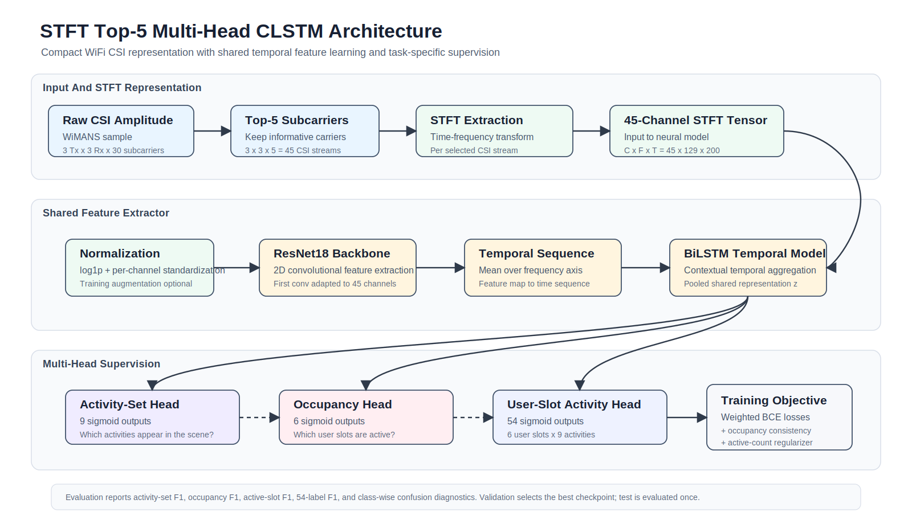

# STFT Top-5 Multi-Head CLSTM Architecture



## Overview

The proposed framework performs multi-user WiFi activity sensing using a compact STFT representation of selected CSI subcarriers. Instead of using all 30 subcarriers, the pipeline keeps the Top-5 selected subcarriers across the 3 transmit and 3 receive antenna pairs, producing 45 CSI streams per sample. Each stream is converted into a time-frequency representation using STFT, yielding a 45-channel tensor.

The model uses a shared feature extractor followed by three task-specific heads. This multi-head design encourages the representation to learn complementary structure: scene-level activity presence, user-slot occupancy, and full user-slot activity assignment.

## Input Representation

Each WiMANS CSI sample is represented as raw CSI amplitude with antenna-pair and subcarrier dimensions. The Top-5 subcarrier selection reduces the input from 270 CSI streams to 45 streams:

```text
3 Tx x 3 Rx x 5 subcarriers = 45 channels
```

For each selected stream, STFT is computed to obtain a time-frequency map. The resulting neural input is:

```text
45 x 129 x 200
```

where 45 is the channel count, 129 is the frequency-bin dimension, and 200 is the fixed temporal length after padding or cropping.

## Shared Encoder

The STFT tensor is first normalized using log compression and per-channel standardization. During training, optional STFT-domain augmentation can be applied, including time masking, frequency masking, channel dropout, small Gaussian noise, time shifting, and mixup. Validation and test samples remain unaugmented.

The shared encoder contains:

```text
ResNet18 convolutional backbone
-> temporal sequence conversion
-> bidirectional LSTM
-> pooled shared representation
```

The first ResNet convolution is adapted to accept 45-channel STFT input. The resulting feature map is averaged over the frequency axis to form a temporal feature sequence. A bidirectional LSTM then models temporal dependencies before producing a shared representation for all prediction heads.

## Multi-Head Outputs

The shared representation is passed to three heads:

```text
Activity-set head: 9 sigmoid outputs
Occupancy head: 6 sigmoid outputs
User-slot activity head: 54 sigmoid outputs
```

The activity-set head predicts which activities are present anywhere in the scene. The occupancy head predicts which of the six user slots are active. The user-slot activity head predicts the full 6 x 9 user-slot activity label space.

## Training Objective

The model is trained with weighted binary cross-entropy losses for all three heads:

```text
L = L_activity_set + L_occupancy + L_slot_activity
```

Additional regularization encourages consistency between the slot-activity head and the occupancy head. An active-count regularizer penalizes mismatch between the predicted and true number of active user slots. This is important because the hard 54-label task can otherwise over-predict active users.

## Evaluation

The evaluation reports:

```text
activity-set F1
occupancy F1
active-slot F1
54-label F1
class-wise confusion diagnostics
```

The validation split is used to select the best checkpoint. The test split is evaluated only once at the end.
